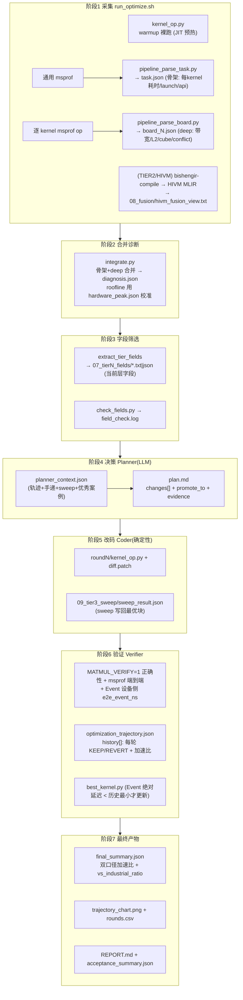

# 可视化讲演图：闭环架构 + 完整数据流

> ★**讲演推荐（v4.6 定稿）**：直接双击打开同目录 **`pipeline_diagrams_v3.html`**（离线 HTML 版，无需装任何插件/联网）——
> 图 1A 为手工 SVG（16:9 布局可控，含 6 层策略条/关键机制/层间决策），图 1B 为手工 SVG 数据流
> （7 阶段 × 文件产物 × 谁写谁读 × 外部输入 × 失败路径），页面带"导出 PNG / SVG"按钮，导出文件可直接放 PPT。
> **以下 mermaid 为简化文本版**（供 VS Code 插件 / typora / mermaid.live 快速预览），讲演请以 HTML 版为准。

> **渲染方式**（md 源文件，任选其一）：
> 1. VS Code 装插件 `Markdown Preview Mermaid Support`，预览本文件即出图
> 2. typora（设置里开 Mermaid 支持）
> 3. 在线 [mermaid.live](https://mermaid.live)：把下方 ```mermaid 块内容粘贴进去，右侧可导出 PNG/SVG（放 PPT 用）
> 4. 命令行出 PNG：`npx -y @mermaid-js/mermaid-cli -i pipeline_visualization.md -o out.svg`（需网络装 puppeteer，较慢）
>
> 图 1A 讲"闭环怎么转"（流程 + 控制流 + 决策），图 1B 讲"数据怎么流"（文件产物 + 谁写谁读）。

---

## 图 1A 闭环架构图（流程与控制流）

```mermaid
flowchart LR
    IN["input/&lt;op&gt;/kernel_op.py<br/>(config+kernel+test 单文件)"] --> SCHED

    subgraph SCHED["Scheduler 状态机主循环  Tier1~6 × RoundN"]
        direction TB
        S1["① 采集+解析<br/>run_optimize: warmup → msprof 双源<br/>→ task.json / board_N.json<br/>→ diagnosis.json (roofline)"] --> S2
        S2["② 分块 sweep (Tier3 轮)<br/>best_kernel 上枚举 L0 合法 BLOCK<br/>Event 实测 → 最优写回"] --> S3
        S3["③ Planner (LLM)<br/>读字段+轨迹+手递+sweep<br/>→ plan.md: changes[] + promote 决策"] --> S4
        S4["④ Coder (确定性)<br/>old→new 精确替换+语法校验<br/>→ roundN/kernel_op.py + diff.patch"] --> S5
        S5["⑤ Verifier<br/>正确性 + msprof 端到端 + Event 设备侧"] --> DEC
        DEC{"Event 绝对延迟<br/>&lt; 历史最优?"} -->|"是 → KEEP"| BK["best_kernel.py 更新<br/>best_round 绑定"]
        DEC -->|"否 → REVERT"| RV["回滚到 best_kernel<br/>failed_kernel.py 留证"]
    end

    BK --> P2{"层间决策"}
    P2 -->|"promote (严格门: 需 evidence)"| NXT["Tier+1<br/>手递 handoff → 目标层"]
    P2 -->|"回退"| PRE["Tier-1"]
    P2 -->|"同层继续"| SCHED
    NXT --> SCHED
    PRE --> SCHED
    P2 -->|"Tier6 连续3轮无改进 / max_rounds"| STOP["停止"]
    STOP --> FIN["final_output:<br/>final_summary.json + 轨迹图<br/>+ REPORT.md + vs_industrial 验收"]

    subgraph EXT["外部数据底座"]
        HW["hardware_peak.json<br/>(run_bench 实测峰值)"]
        IND["industrial_*_tflops.json<br/>(bench_all 各 mode 取 min)"]
        PT["pytorch_*.json<br/>(bench_pytorch 对照)"]
        MEM["memory/tierN_cases.json<br/>(优秀案例回灌)"]
    end
    EXT -. 读 .-> SCHED
```



**讲述要点（对应上面节点）**：
- 闭环的三个核心主张：真机数据驱动（①）→ 确定性优于生成（④：LLM 只决策，改码是精确替换）→ 测量纪律（⑤+DEC：Event 绝对延迟 < 历史最小才进链）
- 层间闭环：promote 必须带 evidence（严格门）、支持回退、跳转写 handoff、同路径 ≥3 次防死循环
- 停止条件：Tier6 连续 3 轮无改进 / 达标后继续探层 / max_rounds（按有效优化轮计，promote 轮免费）

---

## 图 1B 完整数据流图（文件产物 / 谁写谁读）



**讲述要点（对应上面节点）**：
- 每个文件都有明确的"谁写谁读"：采集链（run_optimize.sh→pipeline_parse_*→integrate）写，Planner/Verifier 读
- 双源采集：task.json（骨架，全 kernel 耗时分布） + board_N.json（deep，每个 kernel 的带宽/算力/引擎占用/conflict）→ diagnosis.json 才是有语义的诊断
- roofline 不是静态模型：peak 来自 `hardware_peak.json`（run_bench.py 实测校准），不是纸面理论值
- 最终 vs 工业级：`industrial_*_tflops.json`（bench_all 各 mode Event 取 min，仅真执行）是我们优化效果的天花板对照

---

## 数据来源对照（图表里每个产物对应真实代码）

| 图上节点 | 真实文件 | 说明 |
|---|---|---|
| task.json | `roundN/05_task/task.json` | 通用 msprof 骨架 |
| board_N.json | `roundN/06_diagnosis/board_N.json` | 逐 kernel msprof op 深层 |
| diagnosis.json | `roundN/06_diagnosis/diagnosis.json` | integrate.py 合并 |
| 07_tierN_fields | `roundN/07_tierN_fields/` | extract_tier_fields 筛 |
| hivm_fusion_view.txt | `roundN/08_fusion/` | HIVM MLIR 融合分析 |
| sweep_result.json | `roundN/09_tier3_sweep/` | sweep 实测最优块 |
| 10_tier_handoff.json | `roundN/10_tier_handoff.json` | 跨层手递 |
| plan.md | `roundN/plan.md` | Planner 输出 |
| optimization_trajectory.json | `outputs/&lt;op&gt;/optimization_trajectory.json` | 全轮历史 |
| best_kernel.py | `outputs/&lt;op&gt;/best_kernel.py` | 权威最优 |
| final_summary.json | `outputs/&lt;op&gt;/final_output/` | 最终报告 |
